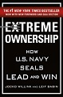
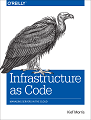
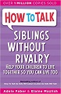

### Hi there 👋 I'm Krzysztof Madej. I'm a .NET software developer implementing Azure cloud based solutions and improving DevOps practices using Azure DevOps.

### Interests
- :cloud: Azure
- Azure DevOps
- Architecture
- C#/F# programming

### Connect with me:

[][website]
[][twitter]
[][linkedin]

 

### Industry Certifications
#### Microsoft

### :books: I’m currently reading/listening ...

  And if you are intered what I already read/listened you can take a look [here](books.md)

### 👯 Community activities:
I'm active user on [Stackoverflow](https://stackoverflow.com/users/2347999/krzysztof-madej) in Azure DevOps area (**TOP 16**). I'm a happy owner of Azure DevOps, Azure Pipelines, Azure bronze badge 😄

#### Not only PR's
[Improvement Azure DevOps documentation: Detailed Manual build reason](https://github.com/MicrosoftDocs/azure-devops-docs/pull/9709)  
[Improvement Azure DevOps Logging commands docs](https://github.com/MicrosoftDocs/azure-devops-docs/commit/58ac83a40752fa30e865757dd2245367acc11851)  
[Reported a bug in Azure Pipelines](https://developercommunity2.visualstudio.com/t/and-condition-on-stage-level-is-incorrectly-evaulu/1236160?from=email)  

<!--
**kmadof/kmadof** is a ✨ _special_ ✨ repository because its `README.md` (this file) appears on your GitHub profile.

Here are some ideas to get you started:

- 🔭 I’m currently working on ...
- 🌱 I’m currently learning ...
- 👯 I’m looking to collaborate on ...
- 🤔 I’m looking for help with ...
- 💬 Ask me about ...
- 📫 How to reach me: ...
- 😄 Pronouns: ...
- ⚡ Fun fact: ...
-->

[website]: http://thecodemanual.pl
[twitter]: https://twitter.com/kmadof
[linkedin]: https://www.linkedin.com/in/krzysztof-madej/
